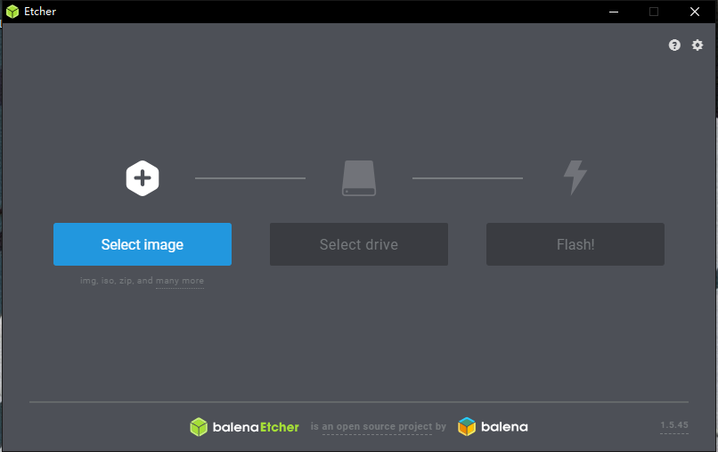
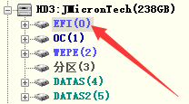
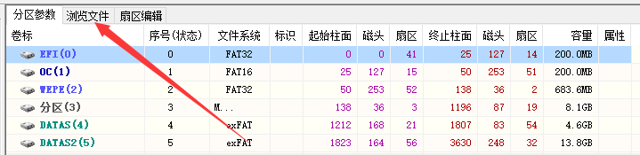
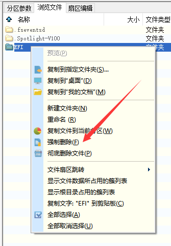
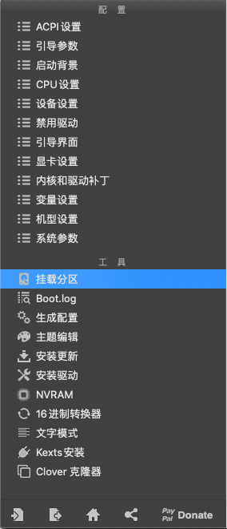

# 准备工作

准备一个16G或以上的U盘/硬盘，最好是USB3.0/3.1的，这样安装的过程会快一些

下载macOS镜像，如果你需要主板HDMI输出的话就安装10.15.4及以前的版本，不然的话装10.15.5也可以

我这里是用的[黑果小兵](https://blog.daliansky.net/WeChat_First-macOS-Catalina-10.15.4-19E2269-official-version-Clover-5116-original-image-reconstruction-version.html)的镜像，macOS的镜像大概都在8G左右

#### 需要用到的软件：

Windows下：

`Etcher`（镜像写入）

`GiskGenius`（更改分区）

macOS下：

`Clover Configurator`（写引导）

`HeliPort`（AX200网卡Wi-Fi用）

`ProperTree`（更改包）

# 开始

首先打开Etcher

选择你下载的镜像和你的U盘，直接Flash即可

这一段的时间根据你U盘的读写速度决定，大概10min

然后打开`GiskGenius`

找到你的U盘，选择EFI分区

选择浏览文件

把里面所有的东西都删除然后替换成我的EFI，里面只保留一个EFI文件夹即可

添加的时候只需要把我的EFI文件夹拖入即可

# 装系统

（我不想再装一遍所以这部分就没有配图……）

重新启动，开机进入BIOS

调整启动项，使U盘为第一启动项

保存，退出

此时开机会进入Clover的引导界面

> 如果你的独显是5700xt的话，你需要在Option里的引导参数加一句“agdpmod=pikera”，不然会黑屏

选择`Boot macOS Install from Install macOS Catalina`

然后就会开始啰嗦模式（滚代码）

> 这个地方及其容易卡，我卡过这么几个地方
>
> 1.`loaded kext`
>
> 显示器接到AMD独显上就好了
>
> 2.`IOConsoleUsers: gIOScreenLockState 3, hs 0, bs 0, nov 0, sm 0x0`
>
> 系统无法识别显卡驱动，有两个解决方法：
>
> （1）用AMD独显
>
> （2）在Option里取消勾选`Inject Intel`
>
> 还有一些奇奇怪怪的卡住的地方，基本没有什么靠谱的解决方法，瞎戳戳说不定就好了，不行就只能主板放电了

顺利的话这一部分应该会持续一会，如果卡在一个地方超过5min就说明是真的卡了，不然的话等一等就好了

然后就会出来苹果的logo

首先选择磁盘工具，选择你要安装的硬盘（我建议单独拿一块固态来装系统，不要跟Windows装一块盘上）

抹掉->（你给磁盘起个名字）->APFS->GUID分区图

关掉磁盘工具，点开安装macOS

一路跟着引导安装就好了

如果能正常走完条然后重启的话最好了

但是我都是卡在剩余2min的时候，这个时候鼠标什么都没有反应

应该是安装的过程中在这里会有一次重启，然后转到硬盘安装不是U盘安装了，但是由于种种原因它重启失败就卡住了

强制重启后进入引导界面

选择`Boot macOS Install form（你给磁盘起的那个名字）`

继续等，这段时间会比较长，可能要30-40min的样子

走完条后就到了设置界面了，按着引导设置即可

# 完善

### EFI替换

接下来就进入系统了，打开我们准备的`Clover Configurator`

选择挂载分区，找到你的U盘和你的安装的磁盘，都点挂载分区

挂载了后打开分区，讲U盘里的EFI文件夹直接拖入安装盘里面即可

现在就可以脱离U盘独自启动了

### 设置机型 打核显驱动

还是用`Clover Configurator`

打开EFI的`config.plist`

具体设置是：

显卡设置->注入Intel显卡

显卡设置->ig-platform-id->选择适合你的

机型设置->下拉选择iMac19,1（也可以选别的）

机型设置->生成新的

变量设置->->生成

### 网卡驱动

AX200网卡的设置可以参考[这里](https://github.com/zxystd/itlwm/issues/146)

# 尾声

短短一点文字好想把装机这个过程简化的不能再简化了，但是这点东西花了我整整四天的时间来折腾

其中也踩过了很多很多很多坑（我感觉我貌似把基本上所有的坑都踩了一遍），过后我会详细写出来与大家分享

如果装机过程中有问题可以问我`lyrance@outlook.com`

